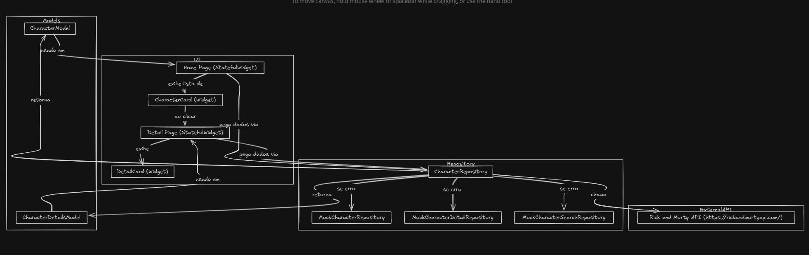

# Rick and Morty API Flutter App

Este projeto é um aplicativo Flutter que consome a API pública do Rick and Morty para listar personagens, buscar por nome e exibir detalhes. Implementa fallback com dados mockados para garantir usabilidade mesmo quando a API estiver indisponível.
<video width="600" controls>
  <source src="docs/video.mp4" type="video/mp4">
</video>

[Se o video não abrir use esse caminho](docs/video.mp4)


---

## Arquitetura e Organização




O projeto segue uma arquitetura simples e organizada para facilitar manutenção, testes e futuras melhorias:

- **`lib/page/`**  
  Contém as telas principais da aplicação:  # Rick and Morty API Flutter App

Este projeto é um aplicativo Flutter que consome a API pública do Rick and Morty para listar personagens, buscar por nome e exibir detalhes. Implementa fallback com dados mockados para garantir usabilidade mesmo quando a API estiver indisponível.

---

## Arquitetura e Organização

O projeto segue uma arquitetura simples e organizada para facilitar manutenção, testes e futuras melhorias:

- **`lib/page/`**  
  Contém as telas principais da aplicação:  
  - `HomePage`: Lista de personagens com busca.  
  - `DetailPage`: Tela de detalhes do personagem selecionado.

- **`lib/components/`**  
  Componentes visuais reutilizáveis:  
  - `CharacterCard`: Cartão individual de personagem na lista.  
  - `DetailCard`: Cartão com detalhes completos do personagem.

- **`lib/data/`**  
  Camada de acesso a dados:  
  - `CharacterRepository`: Repositório que consome a API oficial via HTTP com Dio.  
  - Mocks para fallback: `MockCharacterRepository`, `MockCharacterDetailRepository`, `MockCharacterSearchRepository`.

- **`lib/models/`**  
  Modelos de dados que representam as entidades da aplicação:  
  - `CharacterModel`  
  - `CharacterDetailsModel`

- **`lib/utils/`**  
  Utilitários, constantes e temas globais, como cores (em `app_collors.dart`).

- **`lib/assets/`**  
  Imagens, ícones e fontes usados na interface.

---

## Padrões e Tecnologias Utilizadas

- **Flutter com Dart**  
  Framework e linguagem escolhidos pela produtividade, performance e portabilidade.

- **Dio para requisições HTTP**  
  Facilita o consumo da API REST com interceptors, tratamento de erros e timeout configuráveis.

- **FutureBuilder para UI assíncrona**  
  Gerencia estados de carregamento, sucesso e erro ao buscar dados.

- **Separação clara de responsabilidades**  
  Mantém a lógica de negócio separada da interface e do acesso a dados, facilitando testes e manutenção.

- **Fallback com dados mockados**  
  Garante que o app continue funcional e testável offline ou quando a API estiver indisponível.

- **Estrutura modularizada**  
  Com componentes e páginas separadas, melhora reutilização e organização do código.

---

## Funcionalidades Implementadas

- Listagem de personagens com paginação.
- Busca por nome do personagem.
- Tela de detalhes com imagem, status, espécie, localização e episódio inicial.
- Tratamento de erros e fallback para dados mockados.
- Navegação entre páginas.
- Interface responsiva e estilizada com tema escuro.

---

## Como Rodar o Projeto

## Como Rodar o Projeto

Clone o repositório:

```bash
git clone url_do_repo_aqui

Navegue até o diretório do projeto:


cd rick_morty_app

Instale as dependências:

flutter pub get

Execute o app:

flutter run
